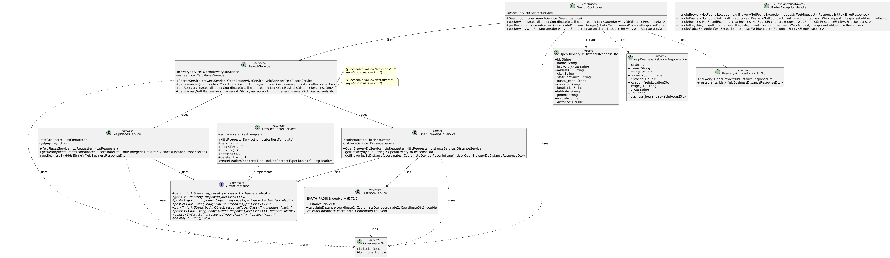

# SoftwareDesignProj - Design Document

**Team:** Aleksanteri Heinonen, Juho Kangas, Kalle Kekäle, Nandan von Veh, Wilhem Tcheng  
**Version:** Final Submission

## 1. Overview

The goal of this application is to let a user pick a city and then browse breweries in that city (data from Open Brewery DB). After selecting a brewery, the app shows nearby restaurants (data from Yelp API) ordered by proximity to that brewery.

### High-level User Flow

1. User selects a city
2. The app fetches breweries in that city from Open Brewery DB, sorted by distance (if coordinates are available)
3. User selects a brewery from the list
4. The app fetches nearby restaurants around that brewery from Yelp and shows them

### 1.1 Use Case Diagram

```
        ┌─────────────────┐
        │      User       │
        └────────┬────────┘
                 │
                 ▼
        ┌──────────────────┐
        │ Select Location  │
        └────────┬─────────┘
                 │
                 ▼
   ┌─────────────────────────────┐
   │  View Brewery List          │
   │  (sorted by distance)       │
   └────────────┬────────────────┘
                │
                ▼
        ┌──────────────────┐
        │ Select Brewery   │
        └────────┬─────────┘
                 │
                 ▼
        ┌──────────────────────────┐
        │ View Restaurant List     │
        │ (sorted by proximity)    │
        └──────────────────────────┘
```

## 2. Data Sources & APIs

### 2.1 Open Brewery DB

- **URL:** `https://api.openbrewerydb.org/v1/breweries`
- **Authentication:** None (public)
- **Usage:** Fetches brewery data by coordinates

### 2.2 Yelp API (Fusion)

- **URL:** `https://api.yelp.com/v3/businesses/search`
- **Authentication:** Bearer token
- **Usage:** Searches restaurants by coordinates, returns ratings, hours, price, and website

## 3. Technologies

### 3.1 Backend

- Java 21, Spring Boot, Maven
- Spring Web (REST), Spring WebClient (HTTP client)
- Redis (caching with 10 min TTL)

### 3.2 Frontend

- TypeScript, React 19, Vite
- TanStack Query (data fetching/caching), Zustand (state management), React Router (routing)

## 4. Architecture

### 4.1 System Architecture

```
┌─────────────┐         ┌──────────────┐         ┌─────────────────┐
│             │         │              │         │                 │
│   React     │ ──────► │  Spring Boot │ ──────► │ Open Brewery DB │
│  Frontend   │         │   Backend    │         │                 │
│             │         │              │         │                 │
└─────────────┘         └──────────────┘         └─────────────────┘
                              │
                              │
                              ▼
                        ┌──────────────┐
                        │              │
                        │   Yelp API   │
                        │              │
                        └──────────────┘
```

### 4.2 Component Overview

#### Frontend

- **App:** Routing shell
- **BreweryList:** Displays breweries with location selection
- **RestaurantList:** Displays restaurants with details (hours, price, rating, website)
- **useNearbyData:** Generic data fetching hook
- **searchService:** API communication
- **locationStore:** Global location state (Zustand)

#### Backend

- **SearchController:** REST endpoints for breweries and restaurants
- **SearchService:** Coordinates searches with Redis caching
- **OpenBreweryDbService:** Fetches brewery data
- **YelpPlacesService:** Fetches restaurant data with Bearer token auth
- **DistanceService:** Haversine distance calculation
- **HttpRequesterService:** Generic HTTP client with retry logic

### 4.4 Class Diagram



### 4.3 Key Implementation Details

#### Frontend

- **App:** Routes "/" → BreweryList, "/restaurants/:breweryName" → RestaurantList
- **BreweryList:** Uses `useNearbyData("breweries")` hook and `locationStore` for location state
- **RestaurantList:** Uses `useNearbyData("restaurants")` hook, displays hours, price, rating, website
- **useNearbyData:** Generic hook with parameters (type, coordinates, limit), uses TanStack Query
- **searchService:** POST to `/api/search/breweries` and `/api/search/restaurants`
- **locationStore:** Zustand store managing `selectedLocation`, `getCurrentLocation()`, and error states

#### Backend

- **SearchController:** Three endpoints:
  - POST `/api/search/breweries?limit={n}` → List<OpenBreweryDbDistanceResponseDto>
  - POST `/api/search/restaurants?limit={n}` → List<YelpBusinessDistanceResponseDto>
  - GET `/api/search/brewery/{id}?restaurantLimit={n}` → BreweryWithRestaurantsDto
- **SearchService:** Uses `@Cacheable` for Redis caching (keys: coordinates+limit)
- **OpenBreweryDbService:** Queries Open Brewery DB API, calculates distances
- **YelpPlacesService:** Queries Yelp API with Bearer token, returns hours/price/website
- **DistanceService:** Haversine formula for distance calculation
- **HttpRequesterService:** WebClient with retry logic and timeout handling
- **GlobalExceptionHandler:** @RestControllerAdvice for consistent error responses

### 4.5 Data Flow

1. User selects location → `useNearbyData("breweries")` → POST `/api/search/breweries`
2. `SearchController` → `SearchService.getBreweries()` (checks Redis cache)
3. Cache miss → `OpenBreweryDbService` → Open Brewery DB API
4. `DistanceService` calculates distances → cached (10 min TTL) → frontend displays breweries
5. User selects brewery → navigate to RestaurantList with coordinates
6. `useNearbyData("restaurants")` → POST `/api/search/restaurants`
7. `SearchService.getRestaurants()` (checks Redis) → cache miss → `YelpPlacesService` → Yelp API
8. Results cached → frontend displays restaurants with hours, price, rating, website

## 5. API Design

### 5.1 Backend REST Endpoints

#### Search API Endpoints

**POST /api/search/breweries?limit={number}**

Request Body:

```json
{
  "latitude": number,
  "longitude": number
}
```

Response:

```json
[
  {
    "id": "string",
    "name": "string",
    "brewery_type": "string",
    "address_1": "string",
    "city": "string",
    "state_province": "string",
    "postal_code": "string",
    "country": "string",
    "longitude": "string",
    "latitude": "string",
    "phone": "string",
    "website_url": "string",
    "distance": number
  }
]
```

**POST /api/search/restaurants?limit={number}**

Request Body:

```json
{
  "latitude": number,
  "longitude": number
}
```

Response:

```json
[
  {
    "id": "string",
    "name": "string",
    "rating": number,
    "review_count": number,
    "distance": number,
    "location": {
      "address1": "string",
      "city": "string",
      "zip_code": "string",
      "country": "string",
      "state": "string"
    },
    "image_url": "string",
    "price": "string",
    "url": "string",
    "business_hours": []
  }
]
```

**GET /api/search/brewery/{breweryId}?restaurantLimit={number}**

Response: Combined brewery and restaurant data

```json
{
  "brewery": {
    "id": "string",
    "name": "string",
    "distance": 0
  },
  "restaurants": []
}
```

### 5.2 Error Handling

Standard HTTP status codes with consistent format: `{ "status": number, "message": string, "details": string }`

## 6. Design Decisions

This section documents the key design decisions made throughout the project, including technology choices, architectural patterns, and responsibility division.

### 6.1 Technology Selection

- **React 19 + TypeScript:** Type-safe component-based UI
- **Vite:** Fast dev server with proxy for CORS
- **TanStack Query:** Server state management with caching
- **React Router:** Client-side routing
- **Zustand:** Lightweight global state
- **Spring Boot + Java 21:** REST API with dependency injection
- **Spring WebClient:** HTTP client with timeout/retry
- **Redis:** Caching layer (10 min TTL)

### 6.2 Design Patterns

- **Service Object:** Frontend searchService for API communication
- **Custom Hooks:** useNearbyData for reusable data fetching logic
- **Dependency Injection:** Constructor-based injection for testability
- **Generic HTTP Client:** Centralized HttpRequester with timeout/retry
- **Facade:** SearchService coordinates brewery and restaurant services

### 6.3 API Integration

- **Open Brewery DB:** Public API, no auth, provides brewery data
- **Yelp Fusion:** Bearer token auth, provides restaurant data (hours, price, website, rating)

### 6.4 Architecture Layers

**Frontend:** UI (components) → Data (hooks) → Service (API) → State (TanStack Query + Zustand)

**Backend:** Controllers (HTTP) → Coordination (SearchService + caching) → Domain (brewery/restaurant services) → Infrastructure (HttpRequester)

### 6.5 Other Decisions

- **CORS:** Vite proxy avoids preflight requests in development
- **Distance:** Haversine formula for great-circle distances
- **API Design:** POST for coordinate searches (body instead of URL params)
- **Quality Focus:** TypeScript/Spring Boot for type safety, established patterns for maintainability, Redis for performance

## 7. Process & Evaluation

### 7.1 Division of Work

Who did what, responsibilities and roles.

#### Wilhelm

- Restructured design document.
- Planned what needs to be done for the midterm submission.
- Wrote about AI usage.
- Made the main use case diagram.
- Documented extra work.

#### Juho

- Created structure for backend implementing global error handling, generic http requester, initial brewery CRUD DTOs.
- Rewieved the PRs of other members .

#### Nandan

- Implemented the base for the frontend frontend.
- Documented self-assesment, changes to original plan, extra work,
  component responsibilities, internal structure, functions of components and
  design decisions.

#### Kalle

- Worked on implementing "Feature: Detailed Restaurant Information" from the extra work section but was unable to finish it in a timely manner and unfortunately the functionality is still very much a work in progress. Will aim to finish this in the near future.

#### Aleksanteri

- Created Yelp for business account & implemented Yelp controller.
- Implemented Redis cache

### 7.2 Self-Assessment

**Success:** All primary goals met - core brewery lookup flow and detailed restaurant information feature fully implemented with comprehensive documentation.

**What Went Well:**
- Clean integration of restaurant details feature
- Effective GitHub collaboration with PR reviews
- Maintained steady progress through distributed responsibilities

**Challenges:**
- Integration complexity with multiple API calls
- Managing external API keys, rate limits, and differing response shapes
- Minor merge conflicts from communication gaps

**Key Learnings:**
- Modular service design simplifies testing and extension
- Clear API contracts prevent rework
- Consistent error handling improves resilience

### 7.3 Changes to Original Plan

**Deferred:** Interactive map view (breweries/restaurants on map)

**Added:** Detailed restaurant information (website, price, hours) from Yelp

**Rationale:** Higher immediate user value, lower implementation complexity, reuses existing Yelp endpoints

### 7.4 Extra Work

Beyond the original plan, we implemented enhanced restaurant information retrieval from the Yelp API. Rather than displaying only basic proximity data, we extended the restaurant list feature to fetch and present detailed information about each establishment when selected by the user.

**Feature: Detailed Restaurant Information**

When a user selects a restaurant from the nearby restaurants list, the application will retrieve comprehensive details from Yelp, including:

- A direct link to the restaurant's website (when available).
- A price category indicator (e.g. $, $$, $$$).
- Opening hours (displayed as today's hours and an optional weekly schedule).

Feature summary

- Website link: When a restaurant has a website URL in Yelp's response we show a clearly labeled link in the restaurant detail view. The link opens in a new tab and uses safe attributes (rel="noopener noreferrer").
- Price category: We map Yelp's price string (for example "$$", "$$$") to a compact UI element next to the restaurant name so users can quickly compare cost levels.
- Opening hours: We request the restaurant's hours information and present today's opening hours prominently; users can expand the view to see the full weekly schedule where available. If hours data is absent, the UI shows a short, user-friendly fallback message.

**Implementation Details:**

Backend:

- Endpoint changes:

  - The unified SearchController at `/api/search` handles all search operations
  - Restaurant details (hours, price, url) are included in the search response via `YelpBusinessDistanceResponseDto`
  - The Yelp API search endpoint returns comprehensive business information including hours, ratings, and website URLs

- Service layer:
  - `YelpPlacesService.getNearbyRestaurants()`: Queries Yelp API with coordinates and returns full business details
  - `YelpPlacesService.getBusinessById()`: Fetches individual business details by Yelp ID
  - Both methods use Bearer token authentication via `@Value("${yelp.api.key}")`
  - HttpRequester supports custom headers for API authentication
- Data mapping and defensive handling:

  - Price and url are optional in Yelp responses; mapping code checks for presence and returns null/empty values where appropriate.
  - Hours are normalized into a consistent format (weekday -> open/close times) and the service calculates today’s schedule based on the brewery/restaurant timezone if available; otherwise it includes the raw hours structure returned by Yelp.

- Error handling:
  - Backend returns consistent error responses when Yelp business details are unavailable (e.g., 404 when Yelp does not have details, 503 on rate limit/third-party failure).

Frontend:

- `RestaurantList` component: Displays restaurant information retrieved from the search endpoint
- Restaurant details are shown directly in the list view, including:
  - Restaurant image (`image_url`)
  - Name and rating (⭐ with review count)
  - Price category (e.g., $, $$, $$$)
  - Address and distance from brewery
  - Business hours formatted by day with open/close times
  - "Open Now" / "Closed" status indicator (🟢/🔴)
  - "View on Yelp" link opening in new tab with `target="_blank"` and `rel="noopener noreferrer"`
- The `useNearbyData("restaurants", ...)` hook fetches all this data in a single API call
- No separate detail view needed - all information displayed in list format

**Documentation**

We made the documention much more comprehensive than required in the submission guidelines.

### 7.5 AI Usage

**Tools used**

- GitHub Copilot
- ChatGPT 5
- Claude 4.5

**Application Areas**

- Translating text to English.
- Design Document drafting (Sections 4-5).
- Inline comments.
- Implementing APIs.
- Frontend drafting.
- Making diagrams look formatted.

**Human Review**

- All AI-generated content underwent thorough review to ensure accuracy, relevance, and alignment with project requirements.

No sensitive data was shared with AI